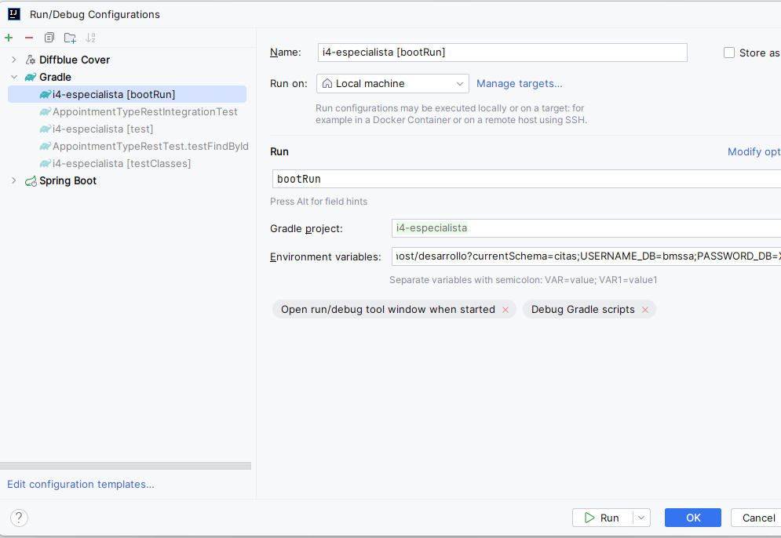

Uso de Webflux Spring Boot

Para ejecutarlo descargar el repositorio y abrirlo con IntelliJ.

Se deben configurar las variables de entorno

```
${URL_DB}
${USERNAME_DB}
${PASSWORD_DB}
```

Ejemplo

URL_DB=r2dbc:postgresql://localhost/desarrollo?currentSchema=citas

USERNAME_DB=usuario

PASSWORD_DB=123456

[](https://)En el ejemplo anterior la url de conexión para una base de datos postgres; accede a una esquema en particular de la base de datos llamada desarrollo, si no es tu caso, eliminar desde el signo de interrogación para una conexión directa y al esquema public.




Los endpoint de acceso son los siguientes

{POST localhost:8080/api/v1/appointment-types }
{GET localhost:808/api/v1/appointment-types }
{GET localhost:808/api/v1/appointment-types/{id} }
{DELETE localhost:808/api/v1/appointment-types/{id} }


Antes de ejecutar el proyecto la primera vez se debe ejecutar en la base de datos el script **appointment_type.sql** ubicado en **src/main/resources/db.migration/**

Verificar que el usuario con el cual se ejecuta dicho script tenga permisos para acceder.

El payload para el POST es el siguiente

{

"name": "Cita de revisión odontológica primera vez",

"description": "Es una cita odontológica de primera vez",

"duration": 20,

"color": "#FF5743"

}
